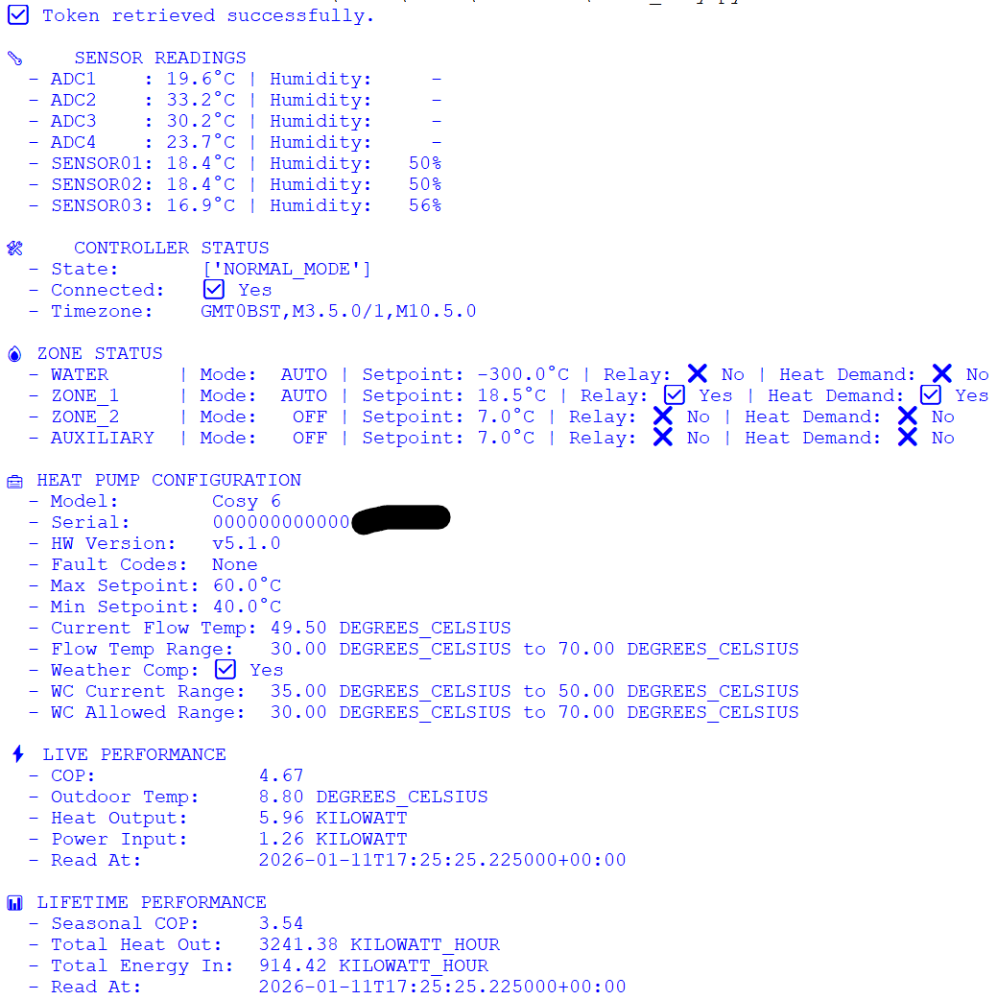

# Octopus Cosy Heat Pump – Python GraphQL Example

This repository contains a **Python example script** demonstrating how to authenticate with the **Octopus Energy GraphQL API** and retrieve data from your **Cosy Heat Pump system**.

The script is intended for **learning, monitoring, and reference purposes only**. It shows how to query:

- Heat pump controller status and configuration
- Sensor readings (temperature, humidity)
- Zone setpoints and modes
- Time series performance metrics (LIVE, daily, weekly, monthly)
- Lifetime performance metrics (seasonal COP, total heat output)

⚠️ **Disclaimer:** This is an unofficial example and is not affiliated with Octopus Energy.

---

## API Endpoint Migration

As of 2025, Octopus Energy migrated heat pump queries to a new backend endpoint. This script uses a **two-endpoint authentication pattern**:

1. **Token acquisition** via the original endpoint: `https://api.octopus.energy/v1/graphql/`
2. **All data queries** via the new endpoint: `https://api.backend.octopus.energy/v1/graphql/`

The JWT token obtained from Step 1 is used as a raw `Authorization` header value (no `Bearer` or `JWT` prefix) for requests to the new endpoint.

### Query Changes

All heat pump queries have dropped the `octo` prefix:

| Old Query | New Query |
|---|---|
| `octoHeatPumpControllerStatus` | `heatPumpControllerStatus` |
| `octoHeatPumpControllerConfiguration` | `heatPumpControllerConfiguration` |
| `octoHeatPumpLifetimePerformance` | `heatPumpLifetimePerformance` |
| `octoHeatPumpLivePerformance` | Replaced by `heatPumpTimeSeriesPerformance` |

The new `heatPumpTimeSeriesPerformance` query supports multiple groupings (`LIVE`, `DAY`, `WEEK`, `MONTH`) and requires COP to be calculated client-side from `energyOutput / energyInput`.

---

## Example Output

Here is a screenshot of the script output in Python IDLE:



---

## 🔐 Security & Privacy

**Important:** The script uses sensitive account information to authenticate. By default, it contains **empty placeholders**, making it safe to share publicly.

```python
email = ""        # Octopus login email
password = ""     # Octopus login password
account_id = ""   # Octopus account ID: A-xxxxxxxx
euid = ""         # Octopus EUID xxxxxxxxxxxxxxxx
```

### Settings

```python
VERBOSE = False   # Set to True to show per-period breakdown in performance data
```
